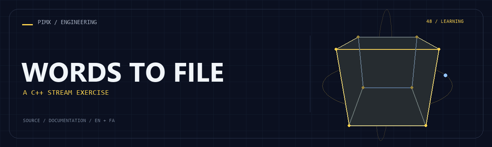

<div align="center">



**[English](README.md) · [فارسی](README.fa.md)**


</div>

# WORDS TO FILE

A C++ console program that reads whitespace-delimited text and writes each value to a file until the user enters exit.

[GitHub](https://github.com/MOHAMMADREZAABEDINPOOR/c-mn) · [PIMX / Profile](https://github.com/MOHAMMADREZAABEDINPOOR) · [Static artwork](assets/readme/hero.png)

## Features

- Console token input
- ofstream output
- exit sentinel

## Stack

| Tool | Version / source |
|---|---|
| C++ | `standard library` |

## Getting started

A C++ compiler such as GCC, Clang or MSVC. The commands below use g++.

```bash
git clone https://github.com/MOHAMMADREZAABEDINPOOR/c-mn.git
cd c-mn

g++ main.cpp -o words-to-file
./words-to-file
```

## Configuration

No standard environment template is defined. Standalone exercises need no external configuration; inspect any service constants or paths in the source before running.

## Usage

Review the hardcoded e:\m.dat destination, compile main.cpp and enter words. Type exit to finish.

## Project structure

| Path | Role |
|---|---|
| [`assets/`](assets/) | Brand/media/README assets |
| [`main.cpp`](main.cpp) | Project entry/configuration file |

## Commands and checks

No automated test command is declared in a manifest. Verify behavior through a local example run.

## Deployment

This is a local learning exercise, not a public service. Browser exercises can use static hosting.

## Limitations

The Windows drive path must exist; output-open failures are not reported. This is a stream-I/O exercise.

## Troubleshooting

- Compiler unavailable: install GCC/Clang/MSVC and adapt the example command.
- Missing output: inspect hardcoded paths, drive permissions and input values.

## Contributing

Create a focused branch, verify the affected behavior and explain the change clearly. Keep private data, build outputs and local databases out of commits.

## License

No repository-level license file is included in this snapshot. Public visibility alone does not grant reuse rights; contact the repository owner for terms.

---

Part of **PIMX** · Documentation in English and Persian.
